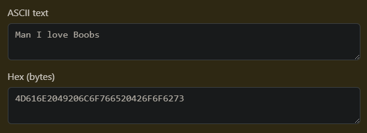

Hey! It's been a while since my last writeup (like I haven't uploaded since last year xd), so I felt like it was time for another one. This time, I'll be going over a cryptography challenge from the recent srdnlenCTF 2025, which features a chess PGN encoding scheme and some classic PRNG cracking. 

# Challenge
> Look at this cool encoding, it's made for chess lovers!! Man I love chess...
>
> This is a remote challenge, you can connect to the service with: `nc chess.challs.srdnlen.it 4012`

[main.py](https://github.com/srdnlen/srdnlenctf-2025_public/blob/main/crypto_Chess/src/main.py) | [src.zip](https://github.com/srdnlen/srdnlenctf-2025_public/tree/main/crypto_Chess/src/src)

## First Imp.ressions

Here's the given code for `main.py`:
```python title="main.py"
from src.encode_to_pgn_2bit import encode_to_pgn
from src.trivia import trivia
from src.pseudorandom import XorShift128
import secrets 
SIZE = 64
MAX_STRING = 300

def main_menu():
    prng = XorShift128(secrets.randbits(SIZE), secrets.randbits(SIZE))

    while True:
            print("\nMain Menu")
            print("1. Encode a string to PGN")
            print("2. Decode a PGN to string")
            print("3. Play trivia")
            print("4. Exit")
            choice = input("Enter your choice (1/2/3/4): ")

            if choice == "1":
                while True:
                    string_to_encode = input(f"Enter the string to encode (max {MAX_STRING} characters): ")

                    if len(string_to_encode) <= MAX_STRING:
                        break
                    else:
                        print(f"String too long! Please enter a string with at most {MAX_STRING} characters.")

                results = [ pgn for pgn in encode_to_pgn(string_to_encode, prng)]
                
                print("encoded pgns:\n")
                for result in results:
                    print(result)

            if choice == "2":
                # Just boring chess stuff, dont worry about it
                continue
                
            elif choice == "3":
                trivia(prng)
            elif choice == "4":
                print("Exiting...")
                break
            else:
                print("Invalid choice. Please try again.")

if __name__ == "__main__":
    main_menu()
```

The corresponding source code in [src.zip](https://github.com/srdnlen/srdnlenctf-2025_public/tree/main/crypto_Chess/src/src) is a lot of files and quite long, so I'll refrain from putting the full contents here, but simply click on the links to view them. (Also note that the source code includes a decoding function, which was not provided in the challenge.)

Anyway, at first glance, you might think this challenge has something to do with the PGN encoding scheme, like decoding some encoded flag or secret message. However, at a closer look, we realize that the `trivia` function seems pretty interesting...

```python title="trivia.py"
import os

FLAG = os.environ.get("FLAG")

players = [
    "Magnus Carlsen", "Hikaru Nakamura", "Garry Kasparov", "Bobby Fischer",
    ...
    "Praggnanandhaa Rameshbabu", "Raunak Sadhwani" 
] # list of 66 chess players


def trivia(prng):

    for _ in range(50):
        choice = prng.choice(players)
        print("Which chess player am I thinking of?")
        if input() == choice:
            print("Well done!")
        else:
            print("Skill issue")
            exit(1)
            return 
    else: 
        print("Here is the flag ---> ", FLAG)
        exit(1)
```

It seems we're actually meant to get the flag this way, by successfully predicting the answers of the trivia game.

Of course, this involves breaking the provided PRNG, which means we should go back and look at the other parts of the challenge.

## PGN Encoding

Going back to main, we can see that the PRNG is created using `XorShift128(secrets.randbits(SIZE), secrets.randbits(SIZE))`, then used in both the `encode_to_pgn` and `trivia` functions.
```python title="main.py"
def main_menu():
    prng = XorShift128(secrets.randbits(SIZE), secrets.randbits(SIZE))
        ...
            if choice == "1":
                while True:
                    string_to_encode = input(f"Enter the string to encode (max {MAX_STRING} characters): ")

                    if len(string_to_encode) <= MAX_STRING:
                        break
                    else:
                        print(f"String too long! Please enter a string with at most {MAX_STRING} characters.")

                results = [ pgn for pgn in encode_to_pgn(string_to_encode, prng)]
                
                print("encoded pgns:\n")
                for result in results:
                    print(result)
            ...
            elif choice == "3":
                trivia(prng)
```

The trivia game is what we're supposed to be breaking by predicting the PRNG, so that means that the `encode_to_pgn` function must be the leaks that give us the ability to crack the PRNG.

First, let's take a look at how the `encode_to_pgn` function works.
```python title="encode_to_pgn_2bit.py"
from collections import defaultdict
from chess import Board, pgn
import chess
from Crypto.Util.number import bytes_to_long, long_to_bytes

def string_to_bits(s):
    binary_string = bin(bytes_to_long(s.encode()))[2:]
    padding_length = (8 - len(binary_string) % 8) % 8
    padded_binary_string = binary_string.zfill(len(binary_string) + padding_length)
    return padded_binary_string

# Dictionary that maps each position on the chessboard to a 2-bit number
dic_tile_to_bits = { 
    f"{chr(col + ord('a'))}{8 - row}": f"{row % 2}{col % 2}"
    for row in range(8)
    for col in range(8)
}

# Inverse dictionary with lists to handle duplicates
dic_bits_to_tile = defaultdict(list)
for k, v in dic_tile_to_bits.items():
    dic_bits_to_tile[v].append(k)
dic_bits_to_tile = dict(dic_bits_to_tile)

def encode_to_pgn(string_to_encode, prng):
    chess_board = Board()
    output_pgns = []
    bits_to_encode = string_to_bits(string_to_encode)

    for i in range(len(bits_to_encode) // 2):
        current_2bits = bits_to_encode[i * 2:i * 2 + 2]

        legal_moves = list(str(k) for k in chess_board.generate_legal_moves())
        possible_moves = dic_bits_to_tile[current_2bits]

        legal_possible_moves = [ legal_move for legal_move in legal_moves if legal_move[2:4] in possible_moves ]

        if not legal_possible_moves:
            pgn_board = pgn.Game()
            pgn_board.add_line(chess_board.move_stack)
            output_pgns.append(str(pgn_board))
            chess_board = Board()

            legal_moves = list(str(k) for k in chess_board.generate_legal_moves())
            possible_moves = dic_bits_to_tile[current_2bits]
            legal_possible_moves = [ legal_move for legal_move in legal_moves if legal_move[2:4] in possible_moves ]

            chosen_move = prng.choice(legal_possible_moves)
            chess_board.push(chess.Move.from_uci(chosen_move))

        else:
            chosen_move = prng.choice(legal_possible_moves)
            chess_board.push(chess.Move.from_uci(chosen_move))

            if chess_board.is_insufficient_material() or chess_board.can_claim_draw():
                pgn_board = pgn.Game()
                pgn_board.add_line(chess_board.move_stack)
                output_pgns.append(str(pgn_board))
                chess_board = Board()

    pgn_board = pgn.Game()
    pgn_board.add_line(chess_board.move_stack)
    output_pgns.append(str(pgn_board))

    return output_pgns
```

This function is a bit complicated so I'll try to break it down slightly.

First, the function breaks down the string into 2-bit chunks. It also initializes some other variables, including the final output as well as the chess board that is used to encode the moves.
```python
def encode_to_pgn(string_to_encode, prng):
    chess_board = Board()
    output_pgns = []
    bits_to_encode = string_to_bits(string_to_encode)

    for i in range(len(bits_to_encode) // 2):
        current_2bits = bits_to_encode[i * 2:i * 2 + 2]
```

Then, for each 2-bit chunk, it generates a list of valid moves from the current board state, then selects the moves from that list the match the parity of the 2-bit chunk. 

For example, the character 'S', which is '01010011' in binary is broken up into '01', '01', '00', '11'. The first 2-bit chunk is '01', which means for the first move in the encoding, the row of the destination square must be odd and the column must be even. This corresponds to squares like 'b8', 'd8', 'h6', etc. The function then filters the list of valid moves to only include those that match the value of the 2-bit chunk.
```python
        legal_moves = list(str(k) for k in chess_board.generate_legal_moves())
        possible_moves = dic_bits_to_tile[current_2bits]

        legal_possible_moves = [ legal_move for legal_move in legal_moves if legal_move[2:4] in possible_moves ]
```

Now, if there are no legal possible moves, the function starts the move selection process again from an empty board. Otherwise, it simply chooses a random move from the legal possible moves using the PRNG, then if the board is in a state where the game cannot continue, it also resets the board.
```python
if not legal_possible_moves:
    pgn_board = pgn.Game()
    pgn_board.add_line(chess_board.move_stack)
    output_pgns.append(str(pgn_board))
    chess_board = Board()

    legal_moves = list(str(k) for k in chess_board.generate_legal_moves())
    possible_moves = dic_bits_to_tile[current_2bits]
    legal_possible_moves = [ legal_move for legal_move in legal_moves if legal_move[2:4] in possible_moves ]

    chosen_move = prng.choice(legal_possible_moves)
    chess_board.push(chess.Move.from_uci(chosen_move))

else:
    chosen_move = prng.choice(legal_possible_moves)
    chess_board.push(chess.Move.from_uci(chosen_move))

    if chess_board.is_insufficient_material() or chess_board.can_claim_draw():
        pgn_board = pgn.Game()
        pgn_board.add_line(chess_board.move_stack)
        output_pgns.append(str(pgn_board))
        chess_board = Board()
```

Finally, it simply puts together all the seperate boards that may have been generated into one final output.
```python
pgn_board = pgn.Game()
pgn_board.add_line(chess_board.move_stack)
output_pgns.append(str(pgn_board))

return output_pgns
```
This means if we're give a PGN encoded string, we can easily decode it by looking at the valid moves from each board state and reconstructing the 2-bit chunks, then converting them back into the original string.

Now, note that the only place the PRNG is used is to select the move from the list of valid moves. Let's see how we can use this to break the PRNG.

## XorShift128
First, let's take a look at the PRNG class implemented in `pseudorandom.py`.
```python title="pseudorandom.py"
def xorshift128(state0, state1):
    s1 = state0
    s0 = state1
    state0 = s0
    s1 ^= s1 << 23 
    s1 &= 0xFFFFFFFFFFFFFFFF
    s1 ^= s1 >> 17
    s1 ^= s0
    s1 ^= s0 >> 26
    state1 = s1
    return state0 & 0xFFFFFFFFFFFFFFFF, state1 & 0xFFFFFFFFFFFFFFFF

class XorShift128:
    
    def __init__(self, state0, state1):
        self.state0 = state0
        self.state1 = state1

    def next(self):
        self.state0, self.state1 = xorshift128(self.state0, self.state1)
        return self.state0 + self.state1

    def choice(self, l):
        return l[self.next() % len(l)]
```

This is a pretty simple implementation of the xorshift128 PRNG. There's nothing inherently wrong with this implementation, although one thing to note is that the `next` function returns the sum of the two states, rather than simply one of them. 

Additionally, the `choice` function returns the result of `next` modulo the length of the list. This means if the list that was passed in was a power of two, we can leak the lower bits of the result of the `next` function.

Actually, if you've worked with these types of PRNGs before, you probably realized that there already exists PRNG solving tools for a lot of things in the xorshift family. Here are a few examples:
- [v8-randomness-predictor](https://github.com/PwnFunction/v8-randomness-predictor)
- [cracking-xoroshiro128plus](https://github.com/lemire/crackingxoroshiro128plus/tree/master)
- [xs128p](https://github.com/TACIXAT/XorShift128Plus/tree/master)

However, the issue with these solvers is that they rely on a large amount of bits being leaked, such as an entire generated float or multiple 64-bit integers. In our case, we only have access to the result of `prng.choice`, since we can see which move was chosen from the list of valid moves. 

If we can somehow get the list of moves that is passed in to always be a power of two, we can reliably leak the lower bits, which can help us recover the state of the PRNG.

## Can I haz bits?

After some brainstorming, we realized that there's no limit on the amount of times we can query the remote service. Since the PRNG is only used in the `encode_to_pgn` and `trivia` functions, we can simply keep encoding strings of our choice to get continuous outputs of the PRNG.

After some trial and error, I found that the binary string '01110010', corresponding to the character 'r', always produces 4 valid moves for each of the 4 2-bit chunks. This means every time we encode the string 'r', we can leak 4 queries of the 2 lowest bits of the PRNG output.

```python
pgns = []
n = 128
for i in trange(n):
    r.recvuntil(b'Enter your choice (1/2/3/4): ')
    r.sendline(b'1')
    r.recvuntil(b'Enter the string to encode (max 300 characters): ')
    r.sendline(b'r')
    r.recvuntil(b'[Result "*"]\n\n')
    pgns.append(r.recvline().decode()) 
```

Thankfully, my teammate made a function to get the bits from the PGN, so I didn't have to worry about that part. 

```python
def get_prng_outputs(string_to_encode, result_moves):
    choice_outputs = []
    chess_board = Board()
    bits_to_encode = string_to_bits(string_to_encode)

    for i in range(len(bits_to_encode) // 2):
        current_2bits = bits_to_encode[i * 2:i * 2 + 2]

        legal_moves = list(str(k) for k in chess_board.generate_legal_moves())
        possible_moves = dic_bits_to_tile[current_2bits]
        legal_possible_moves = [
            legal_move for legal_move in legal_moves if legal_move[2:4] in possible_moves]

        # choice_outputs.append((legal_possible_moves.index(result_moves[i]), len(legal_possible_moves)))
        choice_outputs.append(legal_possible_moves.index(result_moves[i]))

        chosen_move = result_moves[i]
        chess_board.push(chess.Move.from_uci(chosen_move))

    return choice_outputs
```

Anyway, even with this leak, we still need to actually recover the PRNG. After some unsuccessful attempts with Z3, which takes too long for the remote timeout of 4 minutes, I decided to look at some previous writeups for inspiration.
```python title="test_z3.py"
def solve_xorshift128(outputs):
    s = Solver()

    state0 = BitVec('state0', 64)
    state1 = BitVec('state1', 64)

    for output, length in outputs:
        s1 = state0
        s0 = state1
        new_state0 = s0
        s1 ^= s1 << 23
        # s1 &= (1 << 64) - 1
        # s1 ^= s1 >> 17
        s1 ^= LShR(s1, 17)
        s1 ^= s0
        # s1 ^= s0 >> 26
        s1 ^= LShR(s0, 26)
        new_state1 = s1

        # new_state0 = new_state0 & 0xFFFFFFFFFFFFFFFF
        # new_state1 = new_state1 & 0xFFFFFFFFFFFFFFFF

        next_value = new_state0 + new_state1
        # s.add(next_value % length == output)
        # always mod 4, so just extract both 2 bits
        s.add(next_value & 0b11 == output)

        state0 = new_state0
        state1 = new_state1

    if s.check() == sat:
        model = s.model()
        return model[BitVec('state0', 64)], model[BitVec('state1', 64)]
    else:
        return None
```

Eventually, I found [this writeup by 4yn](https://imp.ress.me/blog/2023-04-17/plaidctf-2023/#fastrology) of a very similar challenge from PlaidCTF 2023. This challenge involved cracking the NodeJS `Math.random` function, which happens to use the exact same xorshift128 PRNG as the one here.

## I'm imp.ressed

In the writeup, 4yn converted the entire PRNG state into a symbolic matrix. Because of the way the xorshift128 function works, the state can actually be represented linearly as individual bits. I won't go into the details here, since I didn't create this representation, so please go check out 4yn's writeup for more context.

```python title="symbolic_xorshift128.py"
class BV:
    def __init__(self, data):
        # data is 64-long list of 128 bit ints
        # data[0] is a 128 bit int indicating the mask of bits in s0s1
        #   which are xor-ed together to generate the 0th (LSB) bit of
        #   this state
        # Low 64 bits of s0s1 come from s0, high 64 bits come from s1
        assert(len(data) == 64)
        self.data = data

    def __xor__(self, other):
        return BV([i ^ j for i, j in zip(self.data, other.data)])

    def __lshift__(self, other):
        # After left shift the least significant bits of the state
        # should be empty
        return BV([0] * other + self.data[:-other])

    def __rshift__(self, other):
        # After right shift the most significant bits of the state
        # should be empty
        return BV(self.data[other:] + [0] * other)

    def coef(self, pos):
        # Converts 128 bit mask into list of ints
        coef = f"{self.data[pos]:0128b}"
        coef = [int(i) for i in coef[::-1]]
        return coef

    def eval_one(self, s0s1, pos):
        # From a known s0s1, evalute the bit at one position
        val = sum([i * j for i, j in zip(self.coef(pos), s0s1)]) % 2
        return val

    def eval_all(self, s0s1):
        # From a known s0s1, evalute the bit at all positions and get
        # the u64 output
        vals = [self.eval_one(s0s1, pos) for pos in range(64)]
        vals = "".join([str(i) for i in vals[::-1]])
        vals = int(vals, 2)
        return vals

def xs128p(state0, state1):
    s1 = state0
    s0 = state1

    s1 = s1 ^ (s1 << 23)
    s1 = s1 ^ (s1 >> 17)
    s1 = s1 ^ s0
    s1 = s1 ^ (s0 >> 26)

    output_state = state0
    state0 = state1
    state1 = s1

    return state0, state1, output_state

# Initial symbolic values of s0 and s1
BV.s0 = BV([1 << i for i in range(64)])
BV.s1 = BV([1 << i for i in range(64, 128)])
```

Anyway, in the `fastrology` challenge, the PRNG had to be reversed from the 2 MSBs of the floating point output. Thankfully, we have something very similar, as we can leak the 2 LSBs of the output by encoding the string 'r'.

However, there's another issue here. In the `fastrology` challenge, the xorshift128 function does not return the sum of the two states, only one of them. 

```python
def next(self):
    self.state0, self.state1 = xorshift128(self.state0, self.state1)
    return self.state0 + self.state1
```

This means we cannot simply use the same matrix representation as in the writeup, since the writeup relies on the fact that we can directly match the output with part of state.

## Just be lazy tbh

Realizing this, I spent a while trying to add on to 4yn's solution to implement symbolic addition into the PRNG states.

However, after a while, I realized that I didn't have to do this at all! Instead, if we consider how addition works, we realize that the LSB of the output is simply the XOR of the LSBs of the two states. We don't have to worry about any carries or any other side effects, as we can solely focus on the LSBs of the two states.
$$
\begin{align*}
    \text{output} & = \text{state0} + \text{state1} \\
    \text{output} \mod 2 & = (\text{state0} \mod 2) + (\text{state1} \mod 2) \\
    \text{output} \mod 2 & = (\text{state0} \mod 2) \oplus (\text{state1} \mod 2)
\end{align*}
$$

Since the symbolic BV class already implements XOR, we can simply only track the LSB from each output. However, this means we don't really care about leaking 2 bits anymore, we only really need the lowest bit. In addition, since we need to solve the equations linearly, we will need at least 128 remote queries to get enough equations to solve for the 128 bits of the state.

# Solution
So all we have to do now is put everything all together. Technically, the more remote queries we have, the more likely we are to succeed and get a linear set of equations, but I found that 128 queries worked reasonably well on remote.

After recovering the PRNG state, we simply simulate the trivia function ourselves, put in the correct answers, and capture the flag!

```python title="solve.py"
from sage.all import GF, Matrix, vector
from collections import defaultdict
from chess import Board, pgn
import chess
from Crypto.Util.number import bytes_to_long
from io import StringIO
from pwn import *
from tqdm import trange
from src.pseudorandom import XorShift128


def string_to_bits(s):
    binary_string = bin(bytes_to_long(s.encode()))[2:]
    padding_length = (8 - len(binary_string) % 8) % 8
    padded_binary_string = binary_string.zfill(
        len(binary_string) + padding_length)
    return padded_binary_string


dic_tile_to_bits = {
    f"{chr(col + ord('a'))}{8 - row}": f"{row % 2}{col % 2}"
    for row in range(8)
    for col in range(8)
}

dic_bits_to_tile = defaultdict(list)
for k, v in dic_tile_to_bits.items():
    dic_bits_to_tile[v].append(k)
dic_bits_to_tile = dict(dic_bits_to_tile)


def get_prng_outputs(string_to_encode, result_moves):
    choice_outputs = []
    chess_board = Board()
    bits_to_encode = string_to_bits(string_to_encode)

    for i in range(len(bits_to_encode) // 2):
        current_2bits = bits_to_encode[i * 2:i * 2 + 2]

        legal_moves = list(str(k) for k in chess_board.generate_legal_moves())
        possible_moves = dic_bits_to_tile[current_2bits]
        legal_possible_moves = [
            legal_move for legal_move in legal_moves if legal_move[2:4] in possible_moves]

        # choice_outputs.append((legal_possible_moves.index(result_moves[i]), len(legal_possible_moves)))
        choice_outputs.append(legal_possible_moves.index(result_moves[i]))

        chosen_move = result_moves[i]
        chess_board.push(chess.Move.from_uci(chosen_move))

    return choice_outputs


class BV:
    def __init__(self, data):
        # data is 64-long list of 128 bit ints
        # data[0] is a 128 bit int indicating the mask of bits in s0s1
        #   which are xor-ed together to generate the 0th (LSB) bit of
        #   this state
        # Low 64 bits of s0s1 come from s0, high 64 bits come from s1
        assert (len(data) == 64)
        self.data = data

    def __xor__(self, other):
        return BV([i ^ j for i, j in zip(self.data, other.data)])

    def __lshift__(self, other):
        # After left shift the least significant bits of the state
        # should be empty
        return BV([0] * other + self.data[:-other])

    def __rshift__(self, other):
        # After right shift the most significant bits of the state
        # should be empty
        return BV(self.data[other:] + [0] * other)

    def coef(self, pos):
        # Converts 128 bit mask into list of ints
        coef = f"{self.data[pos]:0128b}"
        coef = [int(i) for i in coef[::-1]]
        return coef

    def eval_one(self, s0s1, pos):
        # From a known s0s1, evalute the bit at one position
        val = sum([i * j for i, j in zip(self.coef(pos), s0s1)]) % 2
        return val

    def eval_all(self, s0s1):
        # From a known s0s1, evalute the bit at all positions and get
        # the u64 output
        vals = [self.eval_one(s0s1, pos) for pos in range(64)]
        vals = "".join([str(i) for i in vals[::-1]])
        vals = int(vals, 2)
        return vals


def xs128p(state0, state1):
    s1 = state0
    s0 = state1

    s1 = s1 ^ (s1 << 23)
    s1 = s1 ^ (s1 >> 17)
    s1 = s1 ^ s0
    s1 = s1 ^ (s0 >> 26)

    state0 = state1
    state1 = s1
    output_state = state0 ^ state1

    return state0, state1, output_state


# Initial symbolic values of s0 and s1
BV.s0 = BV([1 << i for i in range(64)])
BV.s1 = BV([1 << i for i in range(64, 128)])

# r = remote('chess.challs.srdnlen.it', 4012)
r = process(['python3', 'main.py'])

pgns = []
n = 128
for i in trange(n):
    r.recvuntil(b'Enter your choice (1/2/3/4): ')
    r.sendline(b'1')
    r.recvuntil(b'Enter the string to encode (max 300 characters): ')
    r.sendline(b'r')
    r.recvuntil(b'[Result "*"]\n\n')
    pgns.append(r.recvline().decode())

choice_outputs = []
for _pgn in pgns:
    game = chess.pgn.read_game(StringIO(_pgn))
    board = game.board()
    moves = []
    for move in game.mainline_moves():
        moves.append(str(move))
        board.push(move)
    choice_outputs.extend(get_prng_outputs("r", moves))

# print(choice_outputs)

s0, s1 = BV.s0, BV.s1
prng_states = []
for _ in range(n):
    s0, s1, output_state = xs128p(s0, s1)
    prng_states.append(output_state)

mat = []
vec = []
for prng_state, output in zip(prng_states, choice_outputs):
    # we use 1 bit output instead of 2
    # print(prng_state.coef(0), prng_state.coef(1))
    # for idx, bit in enumerate(bin(output)[2:].zfill(2)):
    #     mat.append(prng_state.coef(63 - idx))
    #     vec.append(int(bit))
    mat.append(prng_state.coef(0))
    vec.append(output)

F = GF(2)
mat = Matrix(F, mat)
vec = vector(F, vec)

s0s1 = mat.solve_right(vec)
# print(s0s1)

s0 = s0s1[:64]
s1 = s0s1[64:]
s0 = int("".join([str(i) for i in s0])[::-1], 2)
s1 = int("".join([str(i) for i in s1])[::-1], 2)

prng = XorShift128(s0, s1)
for out in choice_outputs:
    assert (out == prng.next() % 4)

players = [
    "Magnus Carlsen", "Hikaru Nakamura", "Garry Kasparov", "Bobby Fischer",
    "Viswanathan Anand", "Vladimir Kramnik", "Fabiano Caruana", "Ding Liren",
    "Ian Nepomniachtchi", "Anatoly Karpov", "Mikhail Tal", "Alexander Alekhine",
    "Jose Raul Capablanca", "Paul Morphy", "Judith Polgar", "Wesley So",
    "Levon Aronian", "Maxime Vachier-Lagrave", "Sergey Karjakin", "Shakhriyar Mamedyarov",
    "Teimour Radjabov", "Boris Spassky", "Tigran Petrosian", "Veselin Topalov",
    "Peter Svidler", "Anish Giri", "Richard Rapport", "Jan-Krzysztof Duda",
    "Viktor Korchnoi", "Bent Larsen", "David Bronstein", "Samuel Reshevsky",
    "Efim Geller", "Mikhail Botvinnik", "Alexander Grischuk", "Vassily Ivanchuk",
    "Nigel Short", "Michael Adams", "Gata Kamsky", "Ruslan Ponomariov",
    "Vladimir Akopian", "Peter Leko", "Evgeny Bareev", "Alexei Shirov",
    "Vladimir Malakhov", "Boris Gelfand", "Vladimir Fedoseev", "Daniil Dubov",
    "Wei Yi", "Alireza Firouzja", "Vladislav Artemiev", "Dmitry Andreikin",
    "Radoslaw Wojtaszek", "Leinier Dominguez", "Pentala Harikrishna", "Sergey Movsesian",
    "Ernesto Inarkiev", "David Navara", "Vladislav Kovalev", "Jorden Van Foreest",
    "Nihal Sarin", "Vincent Keymer", "Awonder Liang", "Jeffery Xiong",
    "Praggnanandhaa Rameshbabu", "Raunak Sadhwani"
]

trivia_outputs = []
for i in range(50):
    trivia_outputs.append(players[prng.choice(range(66))])

r.recvuntil(b'Enter your choice (1/2/3/4): ')
r.sendline(b'3')
for output in trivia_outputs:
    r.recvuntil(b'Which chess player am I thinking of?\n')
    r.sendline(output)
r.interactive()
```

```shell
$ python3 solve.py 
[+] Starting local process '/usr/bin/python3': pid 27597
100%|████████████████████████████████████████████████████████████████████████████████████████████████████████████████████████████████████████████████████████████████████████████████████████████████████| 128/128 [00:00<00:00, 377.31it/s]
Here is the flag --->  srdnlen{D4mn_I_R3aLly_L1k3_Ch3s5_sTuFf_4D616E2049206C6F766520426F6F6273}
[*] Process '/usr/bin/python3' stopped with exit code 1 (pid 27597)
```
(Note: This was run locally, so it might be slower on remote)

### lol
Also, if you look at the flag closely, the last hex doesn't seem that random.

In fact, it almost seems like ASCII text...


:p